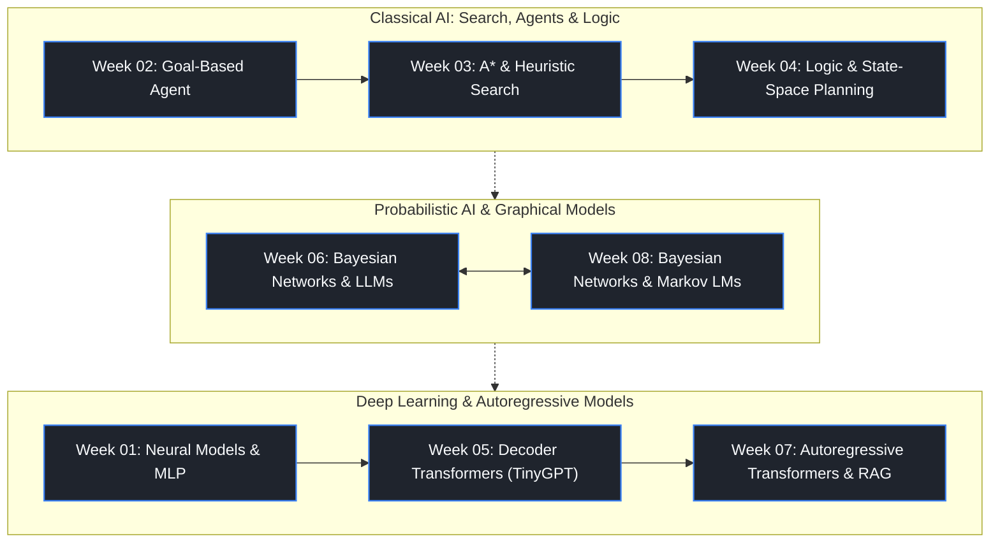

# CS F407 — Artificial Intelligence: Lab Solutions

[](https://python.org/)
[](https://github.com/astral-sh/ruff)
[](#)
[](https://pytorch.org/)
[](.github/workflows/ci.yml)
[](https://www.bits-pilani.ac.in/goa/)

> **Institution:** BITS Pilani, Goa Campus  ·  **Course:** CS F407 — Artificial Intelligence  ·  **Semester:** AY 2026-27, Sem 1  
> **Author:** Samar Talwar (2024A1PS0264G) ·  **License:** Not licensed for reuse or submission by others  ·  **Repository:** https://github.com/tirtharajdash/CS-F407-AI-AY2026-27-S1
> **Quality Gate:** `ruff check .` and `pytest -q` must pass; every value is written unrounded to `results/`; no fabricated outputs.

---

## Executive Summary

A complete, reproducible, from-first-principles implementation of the eight weekly hands-on labs in CS F407. Each week has its own `src/`, `tests/`, `results/` and `CHECKLIST.md`; the root README is a **holistic index only**—it consolidates structure, quality rules and cross-week patterns without duplicating per-week methodology, plots, or raw result keys.

| Dimension | Value |
|---|---|
| **Weeks covered** | 8 (W1–W8) |
| **Total pytest cases** | ~230 (collected without execution) |
| **Per-week structure** | `src/` · `tests/` · `results/` · `README.md` · `CHECKLIST.md` · `REPORT.md` |
| **Quality gates enforced** | Fresh-clone gate · Independent oracle / self-check · Mutation tests · No self-comparison · No unrounded files |
| **Random / LLM policy** | Every seed explicit; LLM calls behind deterministic `stub/` + optional real backend (Ollama); stub outputs labelled "stub" |

---

## Repository Architecture

```
CS-F407-AI-Labs/
├── docs/                  # Lab sheets (W1–W4, W8 PDFs) | Original notebooks (W5–W7) | PROJECT_RULES.md
├── week01_neural_models/ … week08_bayesian_networks/
│   ├── src/              # Importable modules + CLI entry point reproducing results
│   ├── tests/            # pytest; every lab claim has a test
│   ├── results/          # Machine-generated outputs written by CLI (JSON/CSV, full precision)
│   ├── original/         # Professor notebooks (W5–W7 only; NEVER edited)
│   ├── CHECKLIST.md      # Maps each Task / Test / Reflection to file / key
│   ├── REPORT.md         # Summary; numbers come only from results/
│   └── README.md         # Per-week methodology, execution, key findings (NOT repeated here)
├── pyproject.toml         # Python >=3.10 | ruff | pytest config (testpaths = all 8 weeks)
├── requirements.lock.txt
└── README.md              # ← this file (global index only)
```



---

## Week-at-a-Glance (Holistic Index — No Per-Week Detail Repeated)

| # | Week | Core Paradigm | Key Deliverables | Constraint Highlight |
|---|---|---|---|---|
| 1 | Neural Models | PyTorch MLP, BCEWithLogitsLoss | `src/` model + CLI; loss curves; probability check | 2-2-1 net; full batch; random init |
| 2 | Agents | Goal-based warehouse navigation | Agent loop; path planning | Deterministic, no external planner |
| 3 | Search | A* with custom heuristic | `src/search.py` (self-implemented); expanded-node count; path optimality | **No search libraries**; implement A* ourselves |
| 4 | Logic / Planning | Prolog / state-space planning | `prolog/` + planner; unsolvable → `"no plan"` | Hard constraint on impossible inputs |
| 5 | Transformers (notebook) | Autoregressive decoder-only TinyGPT | `original/` preserved; reproduction + stub outputs | Notebook extraction only (`json` dump); never whole-print |
| 6 | Bayesian Networks + LLM | BN inference + LLM interface | `llm_interface` (stub + optional local Ollama) | LLM outputs labelled stub; real backend skipped when absent |
| 7 | AR Models (hands-on) | Transformer + RAG + temperature/top-k | `tests/test_transformers_rag.py`; generation metrics | Independent oracle (NumPy / brute-force) in tests |
| 8 | Bayesian Networks + Markov LM | Plain Python structures; Markov language models | `tests/test_markov_models.py`; probability sums = 1 | No ML library; no pretrained LM |

> **Cross-week quality patterns (not repeated in any week README):**
> - **Independent oracle:** W3 (Dijkstra/BFS vs A*), W7 (NumPy reference), W8 (brute-force / hand-checkable values).
> - **Mutation test:** every core algorithm has a monkeypatch test that breaks the real module and asserts failure.
> - **Negative / baseline cases:** impossible input, trivial case, and baseline model each get their own experiment + result file.
> - **No self-comparison:** equality checks always compare independently computed quantities.
> - **Record-everything:** every value the sheet asks to record/verify/compare (losses, counts, paths, probabilities, expanded nodes) lands unrounded in `results/` with a clear key.

---

## Quality Gates (Mandatory — From W1 Audit)

1. **Fresh-clone gate** — after any commit: `git clone . $env:TEMP\fresh_check`, delete prior copy, then `ruff check .`, `pytest -q`, and the week's CLI with the existing `.venv\Scripts\python.exe` (no `pip install -e`).
2. **Record-everything** — unrounded JSON/CSV in `results/`; `CHECKLIST.md` names exact file + key per row.
3. **Negative / baseline** — separate experiment, separate result file, separate test for each.
4. **Real mutation tests** — monkeypatch the actual `src/` function; assert outcome fails.
5. **No self-comparison** — compare independent computations (oracle vs algorithm, Dijkstra vs A*).
6. **Honest reporting** — stochastic outcomes reported as actual counts over seeds; never claim more than measured; never claim "100%" unless measured.
7. **No rounding in files** — rounding permitted in `REPORT.md` only.
8. **Finish with real command output** — paste `pytest` summary, `ruff` result, pushed commit hash, confirm `git status` clean and `HEAD == origin/main`.
9. **One audit pass only** — do not rewrite code that already passes.

---

## Execution Reference (Reproducible From Any Clone)

```powershell
# 1. Environment (Windows)
.venv\Scripts\Activate.ps1

# 2. Quality checks (run from repo root)
ruff check .
pytest -q                    # ~230 cases across all weeks; uses pytest -q --import-mode=importlib

# 3. Single-week CLI (reproduces results/ from src/; no pip install -e needed)
python -m week03_search.src.search   # example; per-week CLI names vary — see each week/README.md

# 4. Notebook weeks (W5–W7): never print whole
python -c "import json, sys; ... extract with json module to %TEMP%\nb_dump_weekNN.txt ..."
```

---

## Notebook Weeks (W5, W6, W7) — Special Handling

- Original notebooks saved **unmodified** in `week05_transformers_ar/original/`, `week06_bayesian_networks_llm/original/`, `week07_ar_models_handson/original/`. **Never edit `original/`.**
- Checklists map every Task / Exercise / Question / TODO cell / printed result to the reproduction file in `src/`, `results/`, or `tests/`.
- LLM / embedding interface: small deterministic `stub/` backend (all tests + default CLI); optional real backend (local Ollama) enabled only by a flag, detected at runtime, skipped visibly when absent.
- All stub outputs labelled `"stub"` in `results/` and `REPORT.md`.
- Original-notebook outputs kept separate in `results/original_notebook_outputs.json`, labelled accordingly.

---

## Documentation Links

- `docs/PROJECT_RULES.md` — full project rules (sources of truth, layout, code standards, honesty rules, workflow, authorship, quality gates, fresh-clone procedure)
- `docs/prompt_log.md` — every AI-assistant prompt that shaped code (date, week, prompt, what changed after review)
- Per-week `CHECKLIST.md` — requirement-to-file mapping (mandatory for every week; never omit)
- Per-week `REPORT.md` — numeric summaries drawn exclusively from `results/`

---

## Authorship & Notice

Every source file begins with:

```python
# CS F407 Lab, Week N | Author: Samar Talwar | Not licensed for reuse or submission by others.
```

`NOTICE.md` governs reuse; there is no open-source license for original code. The course repository (https://github.com/tirtharajdash/CS-F407-AI-AY2026-27-S1) is credited as the source of the lab sheets.

---

## Status Table (Live — Updated Per Week Completion)

| Week | Hands-on | Source of Truth | Status | Key File (entry) |
|---|---|---|---|---|
| 1 | Neural Models | `docs/lab_sheets/` PDF | ✅ COMPLETE | `week01_neural_models/src/` |
| 2 | Agents | `docs/lab_sheets/` PDF | ✅ COMPLETE | `week02_agents/src/` |
| 3 | Search (A*) | `docs/lab_sheets/` PDF | ✅ COMPLETE | `week03_search/src/search.py` |
| 4 | Logic / Planning | `docs/lab_sheets/` PDF | ✅ COMPLETE | `week04_logic/prolog/` |
| 5 | Transformers (notebook) | `week05_transformers_ar/original/` | ✅ COMPLETE | `week05_transformers_ar/src/` (reproduction) |
| 6 | BN + LLM (notebook) | `week06_bayesian_networks_llm/original/` | ✅ COMPLETE | `week06_bayesian_networks_llm/src/llm_interface.py` |
| 7 | AR Models (hands-on) | `week07_ar_models_handson/original/` | ✅ COMPLETE | `week07_ar_models_handson/src/` |
| 8 | BN + Markov LM | `docs/lab_sheets/` PDF | ✅ COMPLETE | `week08_bayesian_networks/src/` |

---

*This README is the global index only. Method, plots, raw results, reflection placeholders, and per-week execution instructions live in each `weekNN_*/README.md`; they are referenced here by file name, never duplicated.*
